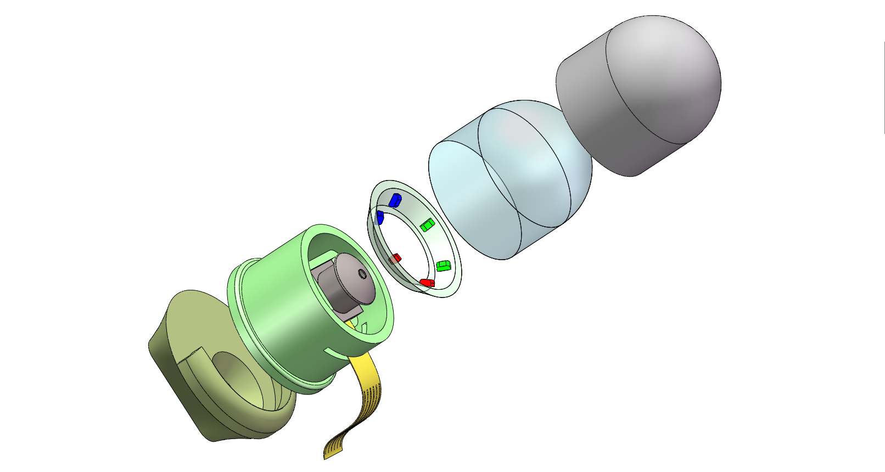

# SofTac

> We proposed a structure and sensing integrated full soft tactile sensor for finger tip.

<br>

## Sensor Structure



<br>

## Febracation


<br>

## Testing


> Cite Bibtex

```
@article{rensoft,
  title={Soft Camera-based Tactile Sensor for Compliant Grasping and Manipulation},
  author={Ren, Jieji and Dong, Yueshi and Gong, Yuru and Zhang, Ningbin and Zou, Jiang and Gu, Guoying},
  journal={ICRA2024 ViTacWorkshop},
  year = {2023}
}
```

